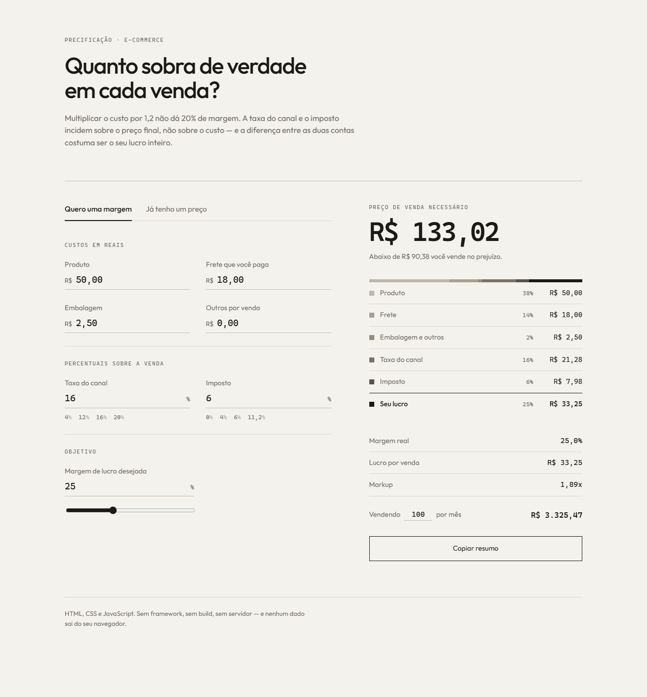

# Calculadora de Margem

Descubra o preço de venda e o **lucro real** de um produto depois da taxa do marketplace, do imposto, do frete e da embalagem.

🔗 **[Testar agora](https://pedrohferraz.github.io/calculadora-margem/)**



Inclui também uma **[calculadora de frete](frete.html)** para quem dirige: a
partir da distância, do consumo do caminhão, do diesel, do pedágio e da
comissão da plataforma, mostra o valor mínimo a cobrar pela viagem — ou,
dada uma proposta recebida, quanto sobra de lucro de verdade.


---

## O problema

A conta que quase todo lojista faz é `custo × 1,20` para "ter 20% de margem".

Ela está errada — e o erro sempre pesa contra o vendedor. A taxa do canal de venda e o imposto incidem sobre o **preço final**, não sobre o custo. Então quanto mais caro o produto, mais dinheiro esses percentuais levam, e menor é a margem que sobra de verdade.

Um exemplo com custo de R$ 50, taxa de 16% e imposto de 6%:

| Conta | Preço | Margem real |
| --- | --- | --- |
| `50 × 1,20` (o jeito errado) | R$ 60,00 | **–5,3%** — prejuízo |
| `50 ÷ (1 − 0,22 − 0,20)` | R$ 86,21 | **20,0%** |

O mesmo produto, R$ 26 de diferença, e um dos dois cenários dá prejuízo a cada venda.

## O que a ferramenta faz

- **Modo "quero margem de X%"** — informa o preço que você precisa cobrar.
- **Modo "já tenho um preço"** — mostra quanto sobra de fato naquele preço.
- **Barra de composição** — para onde vai cada real da venda: produto, frete, embalagem, taxa, imposto e lucro.
- **Preço mínimo** — o valor abaixo do qual toda venda dá prejuízo.
- **Projeção mensal** — o lucro multiplicado pelo seu volume de vendas.
- **Alertas** — avisa quando o preço dá prejuízo ou quando a margem é fina demais para aguentar uma devolução.

Os dados ficam salvos no navegador (`localStorage`) e nada é enviado para lugar nenhum.

## A conta

Sendo `C` a soma dos custos em reais (produto + frete + embalagem + outros), `t` a soma dos percentuais que incidem sobre a venda (taxa + imposto) e `m` a margem desejada:

```
preço = C / (1 − t − m)
```

Quando `1 − t − m ≤ 0`, a combinação é impossível: as taxas mais a margem desejada passam de 100% do preço. A ferramenta detecta isso e explica, em vez de devolver um número absurdo.

O caminho inverso, dado um preço:

```
lucro  = preço − C − (preço × t)
margem = lucro / preço
markup = preço / C
```

## Como rodar

Não tem build, não tem dependência, não tem servidor. Basta abrir o arquivo:

```bash
git clone https://github.com/PedroHFerraz/calculadora-margem.git
```

Depois é só dar dois cliques em `index.html`.

## Testes

A lógica de cálculo fica isolada em [`assets/calc.js`](assets/calc.js) e em
[`assets/calcFrete.js`](assets/calcFrete.js), sem nenhum acesso ao DOM — são os
mesmos arquivos que as páginas carregam e que os testes importam. A suíte usa
o runner nativo do Node, sem biblioteca externa:

```bash
npm test
```

São 21 casos: 10 cobrindo margem alvo, margem impossível, preço mínimo, venda
no prejuízo, campos vazios e a demonstração de que `custo × 1,20` não entrega
20% de margem; e 11 cobrindo a calculadora de frete (custo de combustível,
margem alvo, valor mínimo, lucro por km e proposta abaixo do custo).

## Decisões técnicas

- **JavaScript puro, sem framework.** A página inteira tem menos de 20 KB. Um React aqui só adicionaria build, dependências e tempo de carregamento para resolver um formulário com nove campos.
- **Cálculo separado da interface.** `calc.js` não conhece o DOM, o que torna cada regra testável isoladamente e permite reaproveitar o módulo em outro lugar (uma API, por exemplo).
- **Entrada em formato brasileiro.** Os campos aceitam `1.234,56`, `1234,56` e `R$ 19,90` — usar `<input type="number">` obrigaria o lojista a digitar ponto como separador decimal.
- **Sem back-end.** Preço de custo é informação sensível; mantendo tudo no navegador, não existe dado para vazar.

## Stack

HTML, CSS e JavaScript — nada além disso.

## Licença

MIT
